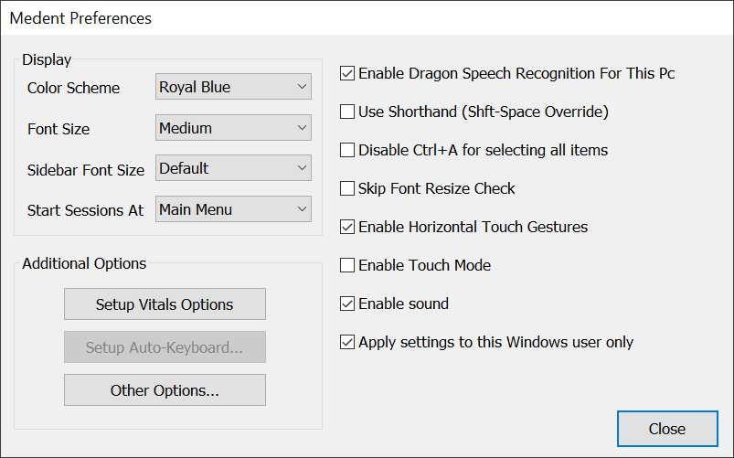

==================
Configuring MEDENT
==================

Change Display Settings
-----------------------
#. **Click** the ☰ icon in the top right
#. **Select** *Settings*, then *My Preferences*, then *Display/PC Settings*
#. From this menu, you can select your preferred color scheme, font size, and other settings

Colorblind Configuration
^^^^^^^^^^^^^^^^^^^^^^^^

#. To configure colorblind options, **select** *Other Options* at the bottom of the previous menu, then *Colorblind Configuration*

#. From this menu, you can choose what colors will appear throughout the MEDENT interface (default colors will appear blank)

#. To change colors, **select** a color and click *Edit Color* (or double click the color)
#. From this window, you can choose or create a color to replace the selected one

Session Management
------------------
Creating Multiple Sessions
^^^^^^^^^^^^^^^^^^^^^^^^^^
#. **Click** the ☰ icon in the top right
#. Click *New Session*
#. This can be repeated multiple times to have 

Arranging and Resizing Sessions
^^^^^^^^^^^^^^^^^^^^^^^^^^^^^^^
#. **Click** the ☰ icon in the top right
#. **Click** *Arrange sessions*
#. If using multiple monitors, **select** if you want to position sessions on the current monitor or all monitors
#. There will now be a number of options to arrange sessions
   #. *Make same size* sets all windows to the size of the current window
   #. *Gather windows* moves all windows to the location of the current window
   #. *Maximize all* sets all windows to fill the screen
   #. *Cascade* arranges all windows in a stack, with each slightly offset from the last
   #. *Horizontal stack* sizes and arranges the windows on top of one another in columns
   #. *Vertical stack *sizes and arranges the windows on top of one another in rows
   #. *Tile* sizes and arranges the windows in columns and rows

Sidebar Options
---------------
Place content here.

Chart Central Configuration
---------------------------
Chart Central has two view settings, which can be switched between using the *Switch Views* button at the top of the screen

Admin View
^^^^^^^^^^

Note View
^^^^^^^^^

Configure Views
^^^^^^^^^^^^^^^
The views can be configured by clicking the gear icon in the top right

DESCRIPTION, or reference general

Background Spell Check
----------------------
Place content here.