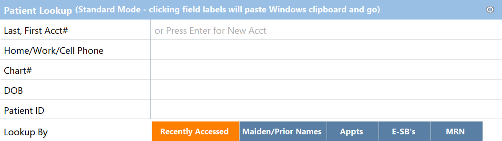

.. |search| image:: images/icons/search.png
   :height: 26px

*******************
Using the Interface
*******************

Main Menu
=========

The main menu is separated into Practice Management and Medical Records. Each section contains links to a number of menus.
*. Additional menu items can be accessed by clicking the |search| icon at the top of each section.
*. You can configure what links are available and what order they are in by clicking the |gear| icon in the top right of each section.
   *. Provide more detailed instructions on how to add links to main menu, see page 102.
   *. If you use one of the options in a popup menu more often, right click that option to add it to the main view.

      .. image:: images/pin-to-menu.png

   *. If you've removed items from the main menu and want to restore them, you can click the *Merge Default* or *Restore Default* at the top of the setup screen.
      *. Merge Default combines the default settings with your current settings, maintaining any changes while bringing back any removed options.
	  *. Restore Default removes all menu items that have been manually added and restores the default ones.
	  
Chart Central Page
------------------

Place content here.

Patient Chart Page
------------------

Place content here.

Patient Info Page
-----------------

Place content here.

HIPAA Page
----------

Place content here.

Documents Page
--------------

Place content here.

Common Interfaces
=================

Patient Lookup
--------------

Many of the main menu options will bring you to a patient lookup screen.

From here, information can be entered to look up specific patients. 

Filter Selection
----------------

Place content here.

Arrow Selection
---------------

Place content here.

Breadcrumb Navigation
=====================

Place content here.